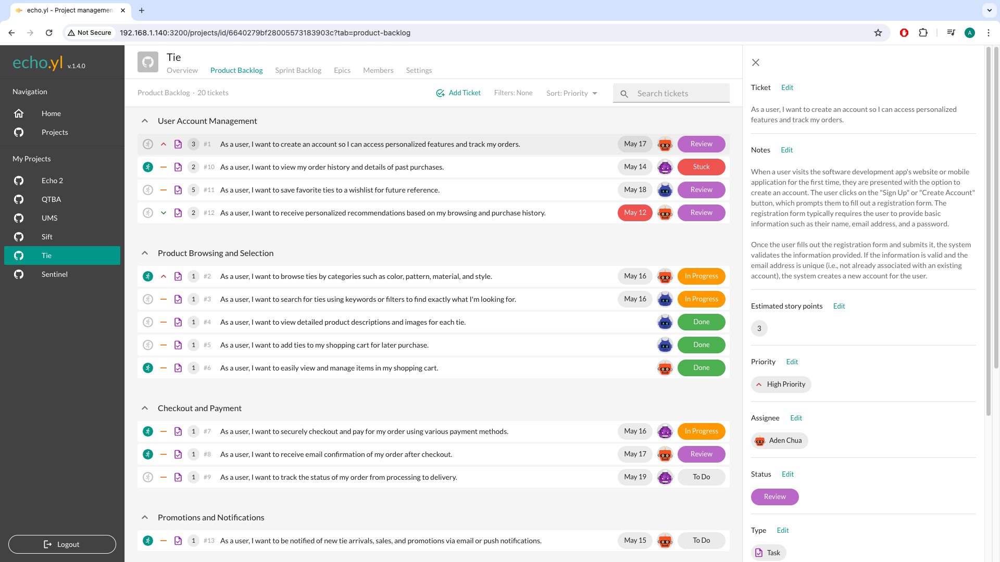

# Echo

Introducing Echo, your all-in-one project management powerhouse that combines the best features of Jira, Monday.com, and Asana into one seamless platform. Say goodbye to the hassle of juggling multiple tools and hello to streamlined efficiency and productivity.

With Echo, you get the robust task management capabilities, allowing you to break down projects into manageable tasks, assign them to team members, and track progress with ease.

With Echo, you can:

- Track Progress: Monitor and manage tasks, deadlines, set epics at a glance and ensure projects stay on track and on schedule.

- Collaborate Effortlessly: Assign tasks, collaborate with team members in real-time.

- Work on Premise: As most project management software solutions on the market move to the cloud, Echo provides an on-premise solution for companies that require a full offline-environment to manage their tasks.

Experience the power of Echo and revolutionize the way you manage projects. Say hello to efficiency, collaboration, and success—all in one place. Try Echo today for free and unleash your team's full potential.

## Project Motivation

This project initially began as a personal endeavor to address the prevalent project management challenges within my workplace. In our software development projects, task tracking and management relied heavily on Excel, which proved to be cumbersome due to limitations in cloud syncing functionality. With Excel, only one user could access and edit the task list at a time, leading to frequent sync conflicts and outdated versions being loaded from the server. Consequently, managing tasks became an arduous chore rather than a streamlined process, contributing to inefficiency and frustration among team members.

## Technology Stack

| Technology | Explanation                                                                                                                                                                                                                                                                                               |
| ---------- | --------------------------------------------------------------------------------------------------------------------------------------------------------------------------------------------------------------------------------------------------------------------------------------------------------- |
| MongoDB    | MongoDB's document-oriented data model allows startups to store data in a format that closely resembles the objects used in their code, providing flexibility and agility in development. This flexibility is particularly advantageous in the early stages when product requirements may evolve rapidly. |
| ExpressJS  | Express.js is a minimalistic and unopinionated framework for Node.js, providing just enough features to build robust web applications without imposing unnecessary constraints.                                                                                                                           |
| ReactJS    | Popular Javascript frontend framework, easy to use to create webapps quickly                                                                                                                                                                                                                              |

## Contribution

This project is maintained solely by [me](https://github.com/adenchua)! If you have any feedback or suggestions, feel free to send me an email.

## System Design

To read my long-winded initial system design considerations, please refer to [this document](SYSTEM-DESIGN.md)
