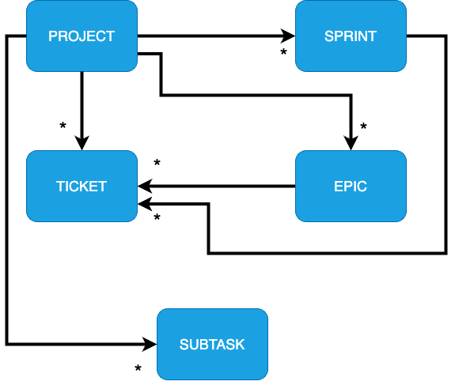

# System Design

This document describes the early high level design considerations

## Requirements

### Functional Requirements

1. A user can create and manage projects, and invite other users into the project.
2. A user can add tickets to the product backlog, and move tickets to start a sprint.
3. Members in the project should be able to update statuses of tickets, add comments, story points, sub-tasks of tickets.
4. A user should be able to group tickets into larger Epics.

### Non-functional Requirements

1. The system should have high availability and reliability

### Traffic & User Estimates

This application is assumed to have 10 monthly active users (MAU). On average, 2 project will be created monthly
and a user will create 15 tickets a month. Performing some calculations:

- 10 users x 15 tickets x 1 month = 150 tickets a month
- 2 project x 1 month = 2 projects a month

## Data Models

### Project

| Key | Field        | Type       | Max field size | Explanation                                                                         | Required |
| --- | ------------ | ---------- | -------------- | ----------------------------------------------------------------------------------- | -------- |
| PK  | id           | string     | 64             | Unique identifier of this document                                                  | Yes      |
|     | title        | string     | 256            | Title of the project                                                                | Yes      |
|     | description  | string     | 512            | Long description of the project                                                     | No       |
|     | announcement | string     | 256            | Optional announcement from admins of the project                                    | No       |
| FK  | adminIds     | ObjectID[] |                | List of admins in this project. At least one administrator is required              | Yes      |
| FK  | memberIds    | ObjectID[] |                | List of members in this project                                                     | No       |
|     | createdDate  | string     | 32             | When the project was created, ISO string                                            | Yes      |
| FK  | epicIds      | ObjectID[] |                | List of epics in this project                                                       | No       |
| FK  | backlogIds   | ObjectID[] |                | List of backlogs in this project                                                    | No       |
| FK  | sprintIds    | ObjectID[] |                | List of sprints in this project. Only one sprint may be active at any point of time | No       |
|     | picture      | number     |                | Defaults to one of the many fixed images of the project. Defaults to 0              | Yes      |
|     | isDeleted    | bool       |                | Safe delete operation to determine if this project is deleted . Defaults to `false` | Yes      |
|     | type         | string     |                | Type of the project                                                                 | Yes      |

### Ticket

| Key | Field        | Type       | Max field size | Explanation                                                                                         | Required |
| --- | ------------ | ---------- | -------------- | --------------------------------------------------------------------------------------------------- | -------- |
| PK  | id           | string     | 64             | Unique identifier of this document                                                                  | Yes      |
|     | title        | string     | 256            | Short description of this ticket                                                                    | Yes      |
| FK  | assigneeId   | ObjectID   |                | Assignee of this ticket                                                                             | No       |
|     | createdDate  | string     | 32             | When the ticket is created in ISO string                                                            | Yes      |
|     | dueDate      | string     | 32             | Optional due date field fo this ticket in ISO string                                                | No       |
|     | status       | enum       |                | One of the following: `todo`, `progress`, `review`, `completed`,`stuck`, `hold`. Defaults to `todo` | Yes      |
|     | priority     | enum       |                | One of the following: `low`, `medium`, `high`, `highest`. Defaults to `medium`                      | Yes      |
|     | type         | enum       |                | One of the following: `story`, `task`, `bug`. Defaults to `story`                                   | Yes      |
| FK  | subtaskIds   | ObjectID[] |                | List of subtasks in this project                                                                    | No       |
|     | isInSprint   | bool       |                | Determine if this ticket is in the sprint backlog                                                   | Yes      |
|     | ticketNumber | number     |                | Ticket number of this ticket                                                                        | Yes      |
| FK  | epicId       | ObjectID   |                | Assigned epic for this ticket                                                                       | No       |
|     | storyPoints  | number     |                | Story points assigned to this ticket. Defaults to 1                                                 | Yes      |

### Epic

| Key | Field       | Type       | Max field size | Explanation                                    | Required |
| --- | ----------- | ---------- | -------------- | ---------------------------------------------- | -------- |
| PK  | id          | string     | 64             | Unique identifier of this document             | Yes      |
|     | title       | string     |                | Short description of this epic                 | Yes      |
|     | description | string     |                | Long description of this epic                  |          |
| FK  | ticketIds   | ObjectID[] |                | List of tickets under this epic                |          |
|     | startDate   | string     | 32             | Optional start date of this epic in ISO string |          |
|     | endDate     | string     | 32             | Optional end date of this epic in ISO string   |          |
|     | createdDate | string     | 32             | When the epic is created in ISO string         | Yes      |

### Sprint

| Key | Field               | Type       | Max field size | Explanation                                                                         | Required |
| --- | ------------------- | ---------- | -------------- | ----------------------------------------------------------------------------------- | -------- |
| PK  | id                  | string     | 64             | Unique identifier of this document                                                  | Yes      |
|     | number              | number     |                | Sprint number                                                                       | Yes      |
|     | startDate           | string     | 32             | Start date of this sprint in ISO string                                             | Yes      |
|     | endDate             | string     | 32             | End date of this sprint in ISO string                                               | Yes      |
| FK  | incompleteTicketIds | ObjectID[] |                | List of incomplete tickets in this sprint. Populated only when the sprint has ended |          |
| FK  | completedTicketIds  | ObjectID[] |                | List of completed tickets in this sprint. Populated only when the sprint has ended  |          |
|     | hasEnded            | bool       |                | Determines if the sprint has ended. Defaults to `false`                             | Yes      |

### Subtask

| Key | Field       | Type   | Max field size | Explanation                                                  | Required |
| --- | ----------- | ------ | -------------- | ------------------------------------------------------------ | -------- |
| PK  | id          | string | 64             | Unique identifier of this document                           | Yes      |
|     | title       | string | 256            | Title of the subtask                                         | Yes      |
|     | isCompleted | bool   |                | Determines if the subtask has completed. Defaults to `false` | Yes      |

## Services

### Project Service

- createProject(project: Project) -> Project
- getProject(id: string) -> Project
- addMembersToProject(memberIds: string[], projectId: string) -> void
- removeMemberFromProject(memberIds: string[], projectId: string) -> void
- updateProject(updatedProject: Project, id: string) -> Project
- getProjectsOfUser(userId: string) -> Projects[]
- promoteMemberToAdmin(userId: string, projectId: string) -> void
- demoteAdminToMember(userId: string, projectId: string) -> void
- deleteProject(id: string) -> Project

---

### Epic Service

- createEpic(epic: Epic, projectId: string) -> Epic
- updateEpic(updatedEpic: Epic, id: string) -> Epic
- addTicketToEpic(ticketId: string, epicId: string) -> void
- removeTicketFromEpic(ticketId: string, epicId: string) -> void
- deleteEpic(id: string) -> Epic

---

### Sprint Service

- startSprint(projectId: string, newSprint: Sprint) -> Sprint
- endSprint(sprintId: string, projectId: string) -> void
- getSprints(ids: string[]) -> Sprint[]

---

### Ticket Service

- createTicket(projectId: string, newTicket: Ticket) -> Ticket
- updateTicket(updatedTicket: Ticket, id: string) -> Ticket
- deleteTicket(id: string) -> void
- getTickets(ids: string[]) -> Ticket[]

---

### Subtask Service

- createSubtask(ticketId: string, newSubtask: Subtask) -> Subtask
- updateSubtask(id: string, updatedSubtask: Subtask) -> Subtask
- deleteSubtask(id: string) -> void
- getSubtasks(ids: string[]) -> Subtask[]

---
